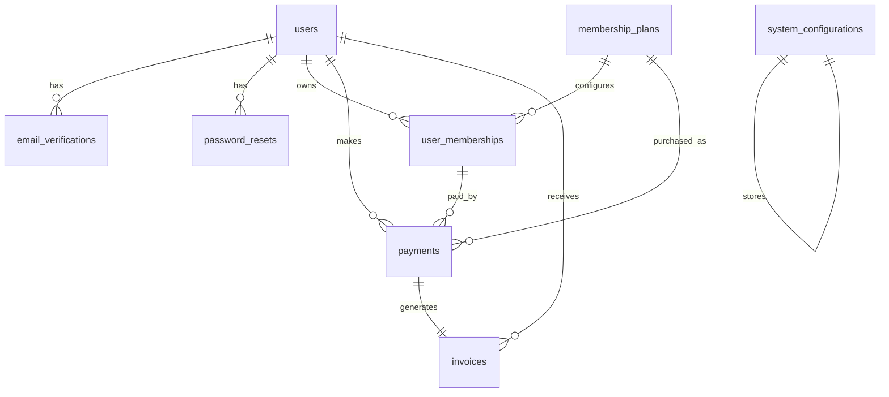

# PostgreSQL ERD

Day 11-20 implemented the core authentication, membership, payment, and invoice tables. Later operational modules remain documented as future relationships only.

## Implemented Tables

- `users`
- `email_verifications`
- `password_resets`
- `membership_plans`
- `user_memberships`
- `system_configurations`
- `payments`
- `invoices`

## Constraints and Index Notes

- Business tables use UUID primary keys.
- `users.email` and `users.phone` are unique and indexed.
- Membership status and expiry date are indexed for lifecycle checks.
- Token tables store hashed tokens only and index token hashes.
- `payments` enforces idempotency with a unique `(user_id, idempotency_key)` constraint.
- `invoices` are immutable billing metadata linked one-to-one with payments.
