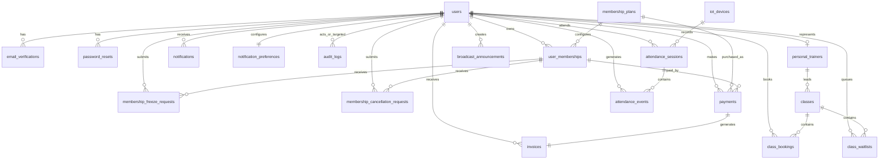

# PostgreSQL ERD for the current release schema



## Migration chain

```text
20260610_0001 baseline
  -> 20260702_0002 account, membership, configuration
  -> 20260702_0003 billing and invoice snapshots
  -> 20260716_0004 membership operations, notification, broadcast, audit
  -> 20260716_0005 attendance, devices, trainers, classes, bookings, waitlists
  -> 20260722_0006 trainer bio and availability summary
  -> 20260723_0007 VND billing localization
```

The database and SQLAlchemy metadata are aligned at `20260723_0007`; `alembic check` reports no pending operations.

## Editable Draw.io diagrams

- [`ypgym-domain-relationships.drawio`](../diagrams/ypgym-domain-relationships.drawio) gives a proposal-ready domain relationship overview.
- [`ypgym-erd.drawio`](../diagrams/ypgym-erd.drawio) contains the detailed implemented PostgreSQL ERD with key attributes, foreign keys and cardinalities.

The release uses the same durable schema as Day42; later analytics/mobile work reuses it. Chatbot logs and fitness forms remain outside this release. Mobile has no separate account or membership tables. Permanent QR-token rows are unnecessary because the authoritative current token JTI is short-lived Redis state.

## Revised table checklist mapping

| Revised-plan table | Implemented model/table | Migration / rationale |
|---|---|---|
| `users` | `User` / `users` | `20260702_0002` account schema |
| `email_verifications`, `password_resets` | `EmailVerification`, `PasswordReset` | `20260702_0002`; hashed one-time token records |
| `membership_plans`, `user_memberships` | `MembershipPlan`, `UserMembership` | Initial membership schema; lifecycle/freeze fields added in `20260716_0004`; VND migration `0007` |
| `payments`, `invoices` | `Payment`, `Invoice` | `20260702_0003` billing and immutable invoice snapshots; VND localization in `0007` |
| `notifications`, `notification_preferences`, `broadcast_announcements` | `Notification`, `NotificationPreference`, `BroadcastAnnouncement` | `20260716_0004` |
| `cancellation_requests` | `MembershipCancellationRequest` / `membership_cancellation_requests` | `20260716_0004`; explicit membership naming is the equivalent, not a missing table |
| Freeze request workflow | `MembershipFreezeRequest` / `membership_freeze_requests` | `20260716_0004`; supports reviewed approval decisions |
| `audit_logs`, `system_configurations` | `AuditLog`, `SystemConfiguration` | Initial configuration schema and `20260716_0004` audit records |
| `qr_tokens` (optional) | No permanent table | Signed QR JWT plus Redis current-JTI/TTL/replay state; do not duplicate short-lived token material |
| `attendance_sessions`, `attendance_events`, `iot_devices` | `AttendanceSession`, `AttendanceEvent`, `IoTDevice` | `20260716_0005` |
| `personal_trainers`, `classes`, `class_bookings`, `class_waitlists` | `PersonalTrainer`, `GymClass`, `ClassBooking`, `ClassWaitlist` | `20260716_0005`; trainer bio/availability in `20260722_0006` |
| `fitness_forms` | Not implemented | Deferred personalization/fitness-data scope; documented variance, no invented model or placeholder |

Apply migrations from the repository root:

```powershell
docker compose exec -T backend-api alembic upgrade head
docker compose exec -T backend-api alembic current
docker compose exec -T backend-api alembic check
```

Use `compose.test.yml` or the standalone demo project for clean-database exercises. Never reset the normal application's volumes to prove migration reproducibility.

## Integrity and query notes

- UUID primary keys are used for business tables.
- One pending freeze and one pending cancellation request per membership are enforced by partial unique indexes.
- One active attendance session per member is enforced by a partial unique index; event/user/time/device lookup paths are indexed.
- QR JWTs are not stored as permanent rows; current JTI state lives in Redis with TTL.
- Payments enforce `(user_id, idempotency_key)` uniqueness; invoices are one-to-one with payments.
- Class capacity and time order use check constraints. Booking and waitlist uniqueness prevent duplicate enrollment, and trainer/location overlap is enforced in the class service under a locked update flow.
- Capacity-changing booking, waitlist, cancellation, and promotion operations serialize on the class row. Waitlist order uses stored position, creation timestamp, and UUID; promotion and notification records commit with the freed slot.
- Trainer bio and availability are nullable profile fields; assigned/upcoming classes remain derived from `classes` rather than duplicated on the trainer row.
- Audit indexes cover timestamp, action, actor, target, and entity lookup.
